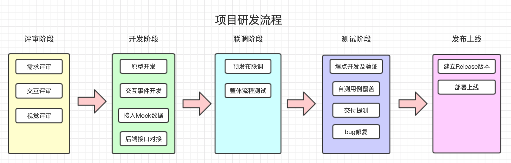

>   项目经由`项目分析`和`项目立项`后，进入项目设计开发环节

## Web项目开发流程图

***

## 评审阶段

> 项目启动，获取`概要需求`，进行`技术评估`和`功能分解`，评估项目开发周期，输出相关文件

- **概要需求评审**

包含业务和技术评审，输出`doc`文档，主要为业务需求描述和简单页面布局

输出：`产品需求文档`

- **交互设计评审**

讨论、确定产品界面布局和业务流程交互原型文档，例：[Sketch](https://www.sketch.com/)、[Axure](https://www.axure.com/)、[墨刀](https://modao.cc/)

规范：`原型设计规范`

输出：`产品原型文档`

- **视觉设计评审**

根据产品原型设计UI界面和图标，一般为`PSD`或`AI`文件包

规范：`UI设计规范`

输出：`产品UI设计稿`

- **项目排期**

经过技术评审后，进行功能分解，给出功能开发周期，形成整体项目排期表，布置开发任务

输出：`技术功能分解表`、`项目排期表`

-   **系统设计**

根据产品功能确定技术实现方案，搭建系统整体架构

输出：`系统架构`、`初始化项目Git库`

## 开发阶段

> 研发人员根据`需求文档`、`交互原型`和`UI设计稿`进入项目开发状态，交互开发使用`Mock`数据模拟后端接口数据，后端接口完成后进行功能联调

- **项目开发**

根据原型文档和UI设计稿设计`页面布局`、`交互组件`

规范：`前端开发规范`、`后端开发规范`

输出：`项目基础文件结构`、`HTML页面`、`CSS样式单`、`JS代码`、`后端项目框架结构`

- **用户交互开发**

根据需求文档、原型文档开发`交互逻辑`，例如：页面渲染、表单联动等

规范：`前端开发规范`、`UI组件库`

输出：`交互代码或组件`

- **接入Mock数据**

与后端确定接口参数，创建`模拟接口数据`

规范：`mock数据说明文档`

输出：`接口mock填充数据`

- **后台接口对接**

后端接口准备好后，切换至后端接口进行`接口调试`

输出：`接口联调`

- **单元测试、功能调试**

为单个函数或方法写测试用例及测试代码，单个功能的整体流程测试

规范：`开发测试编码规范`

输出：`测试用例代码`

- **代码提交**

遵循git-flow工作流，每个功能从`develop`开发分支建立个人的单独功能开发分支，完成功能后合并至`develop`开发分支

规范：`git-flow 工作流`

参考 [git-flow](/create_flow?id=git-flow)

## 联调阶段

> 整合所有页面功能，与后端或接口进行联合调试

- **预发布联调**

基础功能开发完毕后，从业务源头建立或导入数据，进行`单业务全流程`功能测试

推送`develop`分支代码至`测试服务器`并部署，一般由开发人员自行测试

输出：`develop测试分支`

- **整体业务流程测试**

单个功能测试完毕后，进行本项目时间节点的`所有业务功能`测试

提交并合并所有需求分支至`develop`分支，推送代码至`测试服务器`并部署，进行`冒烟测试`

规范：`测试部署规范`

输出：`develop测试分支`

- **生成部署脚本**

给出项目构建部署的脚本，方便运维人员部署上线

输出：`部署脚本`

## 测试阶段

> 项目已通过基本功能测试，业务流程基本畅通，导入测试数据用例进行大数据量整体测试，包含单元测试和端到端测试

- **埋点开发及验证**

在关键业务流转节点，埋入`log节点`，并通过`日志分析`业务流程是否符合需求

输出：`log埋点`

- **自测用例覆盖**

运行`单元测试用例`和`端到端测试用例`，验证代码程序的`可用性`

规范：`用例设计规范`

输出：`测试用例脚本`

- **交付提测**

交付测试人员，进行`业务测试`

规范：`测试流程规范`

输出：`项目提测`

- **缺陷修复**

根据[缺陷管理平台(禅道)](https://www.zentao.net/)的反馈修复Bug并重新提测

规范：`缺陷管理处理流程`

输出：`bug修复`，`bug复测`

## 发布上线

> 根据持续集成环境，进行上线发布

- **建立Release版本**

根据`git flow`流程，合并`Release`分支至`Main`主分支，并打`Tag`

规范：`项目发布流程规范`

输出：`release分支新版本tag`

- **部署上线**

使用[Jenkins](https://www.jenkins.io/zh/)平台，部署指定`Tag`版本

输出：`部署上线`

>   项目上线后如果需要交付就进入最后的`项目交付`环节