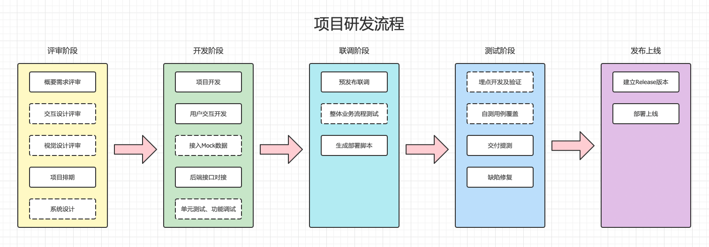

## 流程图

***

## 评审阶段

> 项目立项，获取概要需求，进行技术评估和功能分解，评估项目开发周期，输出相关文件

* 需求评审

包含业务和技术评审，输出`doc`文档，包含业务需求描述和简单页面布局

* 交互评审

输出交互原型文档, 例: [Sketch](https://www.sketch.com/)、[Axure](https://www.axure.com/)、[墨刀](https://modao.cc/)

规范：`原型设计规范`

* 视觉评审

输出UI设计稿，一般为`PSD`或`AI`文件包

规范：`UI设计规范`

* 项目排期

经过技术评审后，进行功能分解，给出功能开发周期，形成整体项目排期表

输出：`项目排期表`

## 开发阶段
> 研发人员根据需求文档、交互原型和UI设计稿进入页面开发状态，交互开发使用`Mock`数据模拟后端接口数据

* 原型开发

根据原型文档和UI设计稿设计`页面布局`、`交互组件`

规范：`前端开发规范-页面构建规范`、`前端开发规范-CSS规范`、`前端开发规范-JS编码规范`

输出：`HTML页面`、`CSS样式单`、`JS代码`

* 用户交互界面开发

根据需求文档、原型文档开发`交互逻辑`

规范：`前端开发规范-JS编码规范`

输出：`交互代码或组件`

* 接入Mock数据

与后端确定接口参数，创建`模拟接口数据`

* 后台接口数据对接

后端接口准备好后，切换至后端接口进行`接口调试`

* 单元测试、功能调试

为单个函数或方法写测试用例及测试代码，单个功能的整体流程测试

规范：`前端开发规范-测试编码规范`、`前端开发规范-JS编码规范`

输出：`测试用例代码`

* 代码提交
遵循git-flow工作流，每个功能从`develop`开发分支建立个人的单独功能开发分支，完成功能后合并至`develop`开发分支

规范：`git-flow 工作流`

## 联调阶段
> 串联所有页面功能，与后端或接口进行联合调试

* 预发布联调

基础功能开发完毕后，从业务源头建立或导入数据，进行`单业务全流程`功能测试

推送`develop`分支代码至`测试服务器`并部署，一般由开发人员自行测试

* 整体业务串联测试流程

单个功能测试完毕后，进行本项目时间节点的`所有业务功能`测试

提交并合并所有需求分支至`develop`分支，推送代码至`测试服务器`并部署，进行整体冒烟测试

* 生成部署脚本

给出项目构建部署的脚本，方便运维人员部署上线

输出：`部署脚本`

## 测试阶段
> 项目已通过基本功能测试，业务流程基本畅通，导入测试数据用例进行大数据量整体测试，包含单元测试和端到端测试

* 埋点开发及验证

在关键业务流转节点，埋入`log节点`，并通过日志分析业务流程是否符合需求

* 自测用例覆盖

运行`单元测试用例`和`端到端测试用例`，验证代码程序的`可用性`

* 交付提测

交付测试人员，进行`业务测试`

* bug修复

根据[缺陷管理平台(禅道)](https://www.zentao.net/)的反馈修复bug并重新提测

## 发布上线
> 根据持续集成环境，进行上线发布

* 建立Release版本

根据`git flow`流程，合并`Release`分支至`Main`主分支，并打`Tag`

* 部署上线

使用[Jenkins](https://www.jenkins.io/zh/)平台，部署指定`Tag`版本